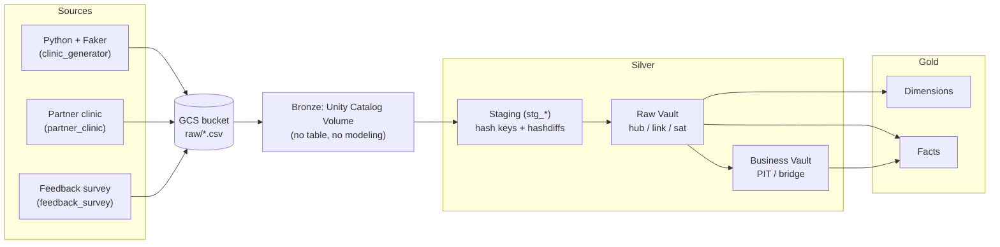

# Clinic DataVault

Portfolio project: a clinic/hospital scheduling data pipeline (appointments,
exams, status tracking and self-pay billing), built end to end with a
**medallion architecture** on top of a **Data Vault 2.0** model, running on
**Databricks** with **dbt** (`dbt-databricks` + `automate_dv`), fed by
synthetic data (Python + Faker) landed on **GCS**.

## Modeled domain

Patients, practitioners, facilities, specialties, insurance providers, exam
types, appointments and exams — each with a **status history**
(`SCHEDULED`, `CONFIRMED`, `CANCELLED`, `RESCHEDULED`, `COMPLETED`,
`NO_SHOW`) and support for **self-pay visits** (with a payment record:
method, amount and status) in addition to insurance-covered visits. Three
source systems feed the pipeline: the clinic's own generator, a partner
clinic's patient registry, and a third-party satisfaction survey — see
[Multi-source integration](#multi-source-integration).

## Architecture at a glance



| Medallion layer | Where it lives | What it holds |
|---|---|---|
| **Bronze** | GCS bucket, read via a Unity Catalog Volume | Raw CSVs, exactly as the generator wrote them. No table, no Data Vault modeling — pure landing zone. |
| **Silver — Raw Vault** | `clinic_dv.raw_vault` | dbt staging models (`stg_*`) type the bronze files and compute hash keys/hashdiffs; hubs, links and satellites are built on top with `automate_dv`. |
| **Silver — Business Vault** | `clinic_dv.business_vault` | PIT and bridge tables — structures that exist purely so reports don't have to repeat expensive joins. |
| **Gold** | `clinic_dv.gold` | Star schema (dimensions + facts) for BI consumption. |

## Repository structure

```
.
├── .env.example                    # environment variable template (copy to .env)
├── requirements.txt                 # faker, pandas, google-cloud-storage, dbt-core, dbt-databricks
├── src/
│   └── generator/
│       ├── config.py                # reads .env into a Config dataclass
│       ├── domains.py                # reference lists: statuses, payment methods, specialties, exam types
│       ├── generate_data.py          # generates synthetic data into data/raw/<entity>/
│       └── upload_to_gcs.py          # uploads data/raw/ to gs://clinic-datavault/raw/
└── dbt/
    ├── dbt_project.yml               # per-folder schema/materialization config
    ├── packages.yml                  # automate_dv (pulls in dbt_utils transitively)
    ├── macros/
    │   └── generate_schema_name.sql  # makes a model's +schema absolute, not target-prefixed
    └── models/
        ├── staging/                  # stg_* — typed bronze data + hash keys/hashdiffs   (schema: raw_vault)
        ├── intermediate/             # int_* — filtered views feeding optional links      (schema: raw_vault)
        ├── raw_vault/
        │   ├── hubs/                 # hub_*                                             (schema: raw_vault)
        │   ├── links/                # lnk_*                                             (schema: raw_vault)
        │   └── satellites/           # sat_*                                             (schema: raw_vault)
        ├── business_vault/
        │   ├── pit/                  # pit_appointment                                   (schema: business_vault)
        │   └── bridges/              # bridge_encounter                                  (schema: business_vault)
        └── gold/
            ├── dimensions/           # dim_*                                             (schema: gold)
            └── facts/                # fact_*                                            (schema: gold)
```

Every `models/**/` folder also has a `_*.yml` file with model descriptions
and dbt tests (`unique`, `not_null`, `relationships`) for everything in it.

---

## Layer-by-layer reference

### 1. Generator (`src/generator/`)

Plain Python, no dbt involved yet. `generate_data.py` creates one CSV per
entity under `data/raw/<entity>/` (git-ignored); `upload_to_gcs.py` (or
`generate_data.py --upload`) copies that folder as-is to
`gs://clinic-datavault/raw/<entity>/`. Counts, seed and paths are all read
from `.env` via `config.py`. `domains.py` holds every fixed reference list
(statuses, payment methods, specialties, exam types) so the generator and
its documentation share a single source of truth.

### 2. Staging (`dbt/models/staging/`, schema `clinic_dv.raw_vault`)

Each model reads its entity's CSVs straight from the Bronze Volume with
`read_files('/Volumes/clinic_dv/bronze/raw_files/<entity>/*.csv', ...)`,
casts columns to proper types, and adds:

- **Hash keys** (one per hub the row will feed) — `sha2(upper(trim(business_key)), 256)`.
  For **master data** (patient, practitioner, facility, insurance provider,
  exam type), the business key is a real, source-independent identifier
  (CPF, CRM license, CNES, ANS registration, TUSS code) — not the internal
  id — precisely so a second source describing the same real-world entity
  resolves to the same hub row (see
  [Multi-source integration](#multi-source-integration)). For
  **transactional** entities (appointment, exam, payment, feedback), the
  internal id *is* the business key — a specific appointment is inherently
  tied to the system that created it, so there's no equivalent
  cross-source identity problem to solve.
- **Link hash keys** (one per link the row will feed) — hashed from the
  *hub hash keys* they connect (already correctly derived from the real
  business keys above), rather than the raw ids a second time.
- **A hashdiff** (`hd_*`) — hash of every descriptive attribute, used by
  satellites to detect whether a row actually changed.
- **Metadata**: `load_date` (`current_timestamp()`) and `record_source`.

| Model | Reads | Computes | Notes |
|---|---|---|---|
| `stg_facilities` | `facilities/*.csv` | `facility_hk` (from `cnes_code`), `hd_facility` | |
| `stg_specialties` | `specialties/*.csv` | `specialty_hk`, `hd_specialty` | still keyed on the internal id — a small, stable controlled vocabulary, not worth a real-world code for this project |
| `stg_insurance_providers` | `insurance_providers/*.csv` | `insurance_provider_hk` (from `ans_registration_number`), `hd_insurance_provider` | |
| `stg_exam_types` | `exam_types/*.csv` | `exam_type_hk` (from `tuss_code`), `hd_exam_type` | |
| `stg_practitioners` | `practitioners/*.csv` | `practitioner_hk` (from `license_number`), `hd_practitioner` | specialty/facility are attributes here, not links (see satellites below) |
| `stg_patients` | `patients/*.csv` | `patient_hk` (from digits-only `cpf`), `hd_patient` | |
| `stg_partner_patients` | `partner_patients/*.csv` | `patient_hk` (same CPF-based formula) | second source; never sends birth_date/sex/address, nulled to line up with `stg_patients` |
| `stg_appointments` | `appointments/*.csv` | `appointment_hk`, `patient_hk`/`practitioner_hk`/`facility_hk`/`insurance_provider_hk` (nullable) looked up via join, `specialty_hk`, `rescheduled_from_hk` (nullable), `lnk_appointment_hk`, `lnk_appointment_insurance_hk` (nullable), `lnk_appointment_reschedule_hk` (nullable), `hd_appointment_detail` | `appointment_hk` uses an `APPOINTMENT-<id>` prefix so it never collides with `exam_hk`; the other hubs' keys are joined in, not re-hashed from the internal id, since their business key doesn't live on this table |
| `stg_appointment_status_history` | `appointment_status_history/*.csv` | `appointment_hk`, `hd_appointment_status` | one row per status change; keeps `status_at` as the real event timestamp |
| `stg_exams` | `exams/*.csv` | `exam_hk` (prefixed `EXAM-<id>`), `source_appointment_hk`, `patient_hk`/`exam_type_hk`/`facility_hk`/`insurance_provider_hk` (nullable) looked up via join, `lnk_exam_hk`, `lnk_exam_insurance_hk` (nullable), `hd_exam_detail` | |
| `stg_exam_status_history` | `exam_status_history/*.csv` | `exam_hk`, `hd_exam_status` | |
| `stg_payments` | `payments/*.csv` | `payment_hk`, `reference_hk`, `lnk_payment_hk`, `hd_payment` | `reference_hk` is hashed as `<reference_type>-<reference_id>` so it lands on the *same* value as `appointment_hk`/`exam_hk` depending on `reference_type` |
| `stg_patient_feedback` | `patient_feedback/*.csv` | `feedback_hk`, `patient_hk` (from `cpf`), `appointment_hk`, `lnk_feedback_hk`, `hd_feedback` | third source; identifies the patient by CPF (not our internal `patient_id`, which it never learned) |

### 3. Raw Vault — Hubs (`dbt/models/raw_vault/hubs/`, schema `clinic_dv.raw_vault`)

One row per distinct business key, loaded insert-only via
`automate_dv.hub()`. All 9 follow the identical pattern:
`src_pk` (hash key) + `src_nk` (business key) + `src_ldts` (`load_date`) +
`src_source` (`record_source`) + `source_model` (the matching `stg_*`).

| Hub | Business key | Source model(s) |
|---|---|---|
| `hub_patient` | `cpf` | `stg_patients`, `stg_partner_patients` — **multi-source**: `automate_dv.hub()` accepts a list and unions them |
| `hub_practitioner` | `license_number` (CRM) | `stg_practitioners` |
| `hub_facility` | `cnes_code` | `stg_facilities` |
| `hub_specialty` | `specialty_id` | `stg_specialties` |
| `hub_insurance_provider` | `ans_registration_number` | `stg_insurance_providers` |
| `hub_exam_type` | `tuss_code` | `stg_exam_types` |
| `hub_appointment` | `appointment_id` | `stg_appointments` |
| `hub_exam` | `exam_id` | `stg_exams` |
| `hub_payment` | `payment_id` | `stg_payments` |
| `hub_feedback` | `feedback_id` | `stg_patient_feedback` |

### 4. Raw Vault — Links (`dbt/models/raw_vault/links/`, schema `clinic_dv.raw_vault`)

Built with `automate_dv.link()`: `src_pk` (the link's own hash key) +
`src_fk` (the list of hub hash keys it connects) + `src_ldts`/`src_source`
+ `source_model`. Optional relationships (a link that shouldn't exist for
every row) are first filtered through an `intermediate/int_*` view,
because `automate_dv.link()` expects an already-scoped source model — it
has no built-in row filter.

| Link | Connects (`src_fk`) | Source model | Populated when |
|---|---|---|---|
| `lnk_appointment` | `appointment_hk`, `patient_hk`, `practitioner_hk`, `facility_hk`, `specialty_hk` | `stg_appointments` | always |
| `lnk_appointment_insurance` | `appointment_hk`, `insurance_provider_hk` | `int_appointments_with_insurance` | `visit_type = INSURANCE` |
| `lnk_appointment_reschedule` | `appointment_hk`, `rescheduled_from_hk` | `int_appointments_rescheduled` | the appointment replaced an earlier one |
| `lnk_exam` | `exam_hk`, `patient_hk`, `exam_type_hk`, `facility_hk`, `source_appointment_hk` | `stg_exams` | always |
| `lnk_exam_insurance` | `exam_hk`, `insurance_provider_hk` | `int_exams_with_insurance` | `visit_type = INSURANCE` |
| `lnk_payment_appointment` | `payment_hk`, `reference_hk` | `int_payments_for_appointments` | `reference_type = APPOINTMENT` |
| `lnk_payment_exam` | `payment_hk`, `reference_hk` | `int_payments_for_exams` | `reference_type = EXAM` |
| `lnk_feedback` | `feedback_hk`, `patient_hk`, `appointment_hk` | `stg_patient_feedback` | always |

A payment is split into two links instead of one polymorphic link because
it references *either* an appointment or an exam, never both — each link
connects to exactly one hub, which is the whole point of a link.

### 5. Raw Vault — Satellites (`dbt/models/raw_vault/satellites/`, schema `clinic_dv.raw_vault`)

Built with `automate_dv.sat()`: `src_pk` (parent hub's hash key) +
`src_hashdiff` + `src_payload` (the descriptive columns) +
`src_ldts`/`src_source` + `source_model`.

| Satellite | Parent hub key | Payload | `src_ldts` |
|---|---|---|---|
| `sat_patient` | `patient_hk` | name, cpf, birth_date, sex, phone, email, address, city, state | `load_date` |
| `sat_feedback` | `feedback_hk` | rating, comments | `load_date` |
| `sat_practitioner` | `practitioner_hk` | name, license_number, specialty_id, facility_id, phone, email | `load_date` |
| `sat_facility` | `facility_hk` | name, address, city, state, phone | `load_date` |
| `sat_specialty` | `specialty_hk` | name | `load_date` |
| `sat_insurance_provider` | `insurance_provider_hk` | name, ans_registration_number | `load_date` |
| `sat_exam_type` | `exam_type_hk` | name, category, self_pay_price | `load_date` |
| `sat_appointment_detail` | `appointment_hk` | scheduled_at, created_at | `load_date` |
| `sat_appointment_status` | `appointment_hk` | status | **`status_at`** |
| `sat_exam_detail` | `exam_hk` | scheduled_at, created_at | `load_date` |
| `sat_exam_status` | `exam_hk` | status | **`status_at`** |
| `sat_payment` | `payment_hk` | amount, payment_method, payment_status, paid_at | `load_date` |

The two status satellites use `status_at` (the real event time) instead of
the generic `load_date`, so the history reflects when a status actually
changed rather than whenever dbt happened to run. `specialty_id`/
`facility_id` live in `sat_practitioner` as plain attributes, not as a
link — a practitioner has exactly one current specialty/facility, and that
assignment can change over time, which is exactly what a satellite tracks
(a link is for relationships that are inherently transactional, like an
appointment joining four hubs at once).

`sat_patient` is multi-source, but its `source_model` is
`int_patients_unioned` (a plain `UNION ALL` of `stg_patients` and
`stg_partner_patients`), not a list: unlike `automate_dv.hub()`,
`automate_dv.sat()` in this version only accepts a single source model, so
the union has to be done explicitly first.

### 6. Business Vault (`dbt/models/business_vault/`, schema `clinic_dv.business_vault`)

Plain SQL, not `automate_dv` — the package's `pit()`/`bridge()` macros need
an extra "as-of dates" scaffolding whose exact shape wasn't worth guessing;
explicit SQL is also more transparent for this purpose.

- **`pit_appointment`**: for every `hub_appointment` row × a daily snapshot
  spine (`sequence()`, last 180 days), resolves the status in effect on
  that date. Joins `hub_appointment` × `stg_appointment_status_history` on
  `status_at <= snapshot_date`, keeping the most recent one per
  `(appointment_hk, snapshot_date)` via `row_number()`. Exists so a report
  asking "what was the status as of date X" doesn't repeat that as-of join
  itself.
- **`bridge_encounter`**: one row per appointment, flattening
  `lnk_appointment` (core) `LEFT JOIN` `lnk_appointment_insurance`
  `LEFT JOIN` `lnk_exam` (matched on `source_appointment_hk`)
  `LEFT JOIN` `lnk_payment_appointment` `LEFT JOIN` `lnk_payment_exam`
  (matched through the exam it belongs to) `LEFT JOIN` `lnk_feedback`.
  Exists so a report doesn't need to traverse 6 link tables to know "did
  this appointment have an exam, was either of them paid, and did the
  patient leave feedback".

### 7. Gold (`dbt/models/gold/`, schema `clinic_dv.gold`)

Most **dimensions** read straight from `staging`, not from hub+satellite:
the generator only ever produces one snapshot per entity, so staging
already holds exactly one row per hash key — no "latest version"
resolution needed. `dim_date` is the only one with no hub behind it (a
standalone calendar, 2 years back to 1 year ahead of today). `dim_patient`
is the exception — see below.

| Dimension | Source |
|---|---|
| `dim_date` | generated (`sequence()`), no source model |
| `dim_patient` | `hub_patient` + `sat_patient` (survivorship — see [Multi-source integration](#multi-source-integration)) |
| `dim_practitioner` | `stg_practitioners` |
| `dim_facility` | `stg_facilities` (now includes `cnes_code`) |
| `dim_specialty` | `stg_specialties` |
| `dim_insurance_provider` | `stg_insurance_providers` |
| `dim_exam_type` | `stg_exam_types` (now includes `tuss_code`) |

**Facts:**

| Fact | Grain | Built from |
|---|---|---|
| `fact_appointment` | one row per appointment | `stg_appointments` (core columns) `LEFT JOIN` `pit_appointment` filtered to `snapshot_date = current_date()` (for `current_status`, falling back to `stg_appointments.current_status` if missing) `LEFT JOIN` `bridge_encounter` (for `exam_hk`/`exam_type_hk`/`has_exam`/`feedback_hk`/`has_feedback`) `LEFT JOIN` `stg_payments` (via the bridge's `appointment_payment_hk`, for `amount_paid`) `LEFT JOIN` `stg_patient_feedback` (via the bridge's `feedback_hk`, for `feedback_rating`) |
| `fact_exam` | one row per exam | `stg_exams` (already carries every relevant hash key) `LEFT JOIN` `lnk_payment_exam` `LEFT JOIN` `stg_payments` (for `amount_paid`) |
| `fact_payment` | one row per payment | `stg_payments` directly — independent of whether it references an appointment or an exam, for revenue reporting that shouldn't care which |
| `fact_feedback` | one row per feedback submission | `stg_patient_feedback` directly — already carries `feedback_hk`, `appointment_hk` and `patient_hk` |

### Multi-source integration

Three source systems land in `raw/` and get their own `record_source`:

| `record_source` | System | What it sends |
|---|---|---|
| `clinic_generator` | Our own scheduling system | Everything: patients, practitioners, facilities, appointments, exams, payments |
| `partner_clinic` | A partner clinic's patient registry | Patients only — some already known to us (same CPF, its own internal id, contact details that may have drifted), some it alone has ever seen |
| `feedback_survey` | A third-party satisfaction survey | Feedback on completed appointments, identifying the patient by CPF (not our internal `patient_id`, which it never learned) and the appointment by the id we passed it |

This is the reason `hub_patient`'s business key is CPF rather than the
internal `patient_id`: a patient described by two systems resolves to the
*same* hub row, and `sat_patient` ends up with one row per
`(patient_hk, record_source)` — sometimes two descriptions of the same
person that disagree (a different phone number, a missing birth date).
`dim_patient` resolves this with an explicit, simple survivorship rule —
prefer `clinic_generator` when both exist, otherwise take whichever is
available — surfaced as `golden_record_source` for transparency.

`hub_feedback`/`lnk_feedback` show the same pattern from a different
angle: a transactional hub (feedback has no "master data" identity
problem — a specific submission belongs to the survey tool that captured
it) that still needs to *resolve* into the existing graph via a universal
key (CPF for the patient, the shared appointment id for the visit).

Query to see the effect directly:
```sql
-- Patients with a satellite record from more than one source
SELECT patient_hk, count(distinct record_source) AS source_count
FROM clinic_dv.raw_vault.sat_patient
GROUP BY patient_hk
HAVING count(distinct record_source) > 1;
```

---

## Environment setup

Everything below the generator step needs to exist **before** `dbt run`
will work. Order matters.

### 1. Local machine

- Python 3.11+, `pip install -r requirements.txt` (installs Faker, pandas,
  `google-cloud-storage`, `dbt-core`, `dbt-databricks`).
- `gcloud` CLI, authenticated to your GCP project.

### 2. GCP

```bash
gcloud storage buckets create gs://clinic-datavault --location=us-central1

gcloud iam service-accounts create clinic-uploader --display-name="Clinic DataVault Uploader"

gcloud storage buckets add-iam-policy-binding gs://clinic-datavault \
  --member="serviceAccount:clinic-uploader@<your-project-id>.iam.gserviceaccount.com" \
  --role="roles/storage.objectAdmin"

gcloud iam service-accounts keys create clinic-uploader-key.json \
  --iam-account=clinic-uploader@<your-project-id>.iam.gserviceaccount.com
```

Move the generated key **outside this repository** (e.g.
`~/.gcp-keys/clinic-uploader-key.json`) — it's a live credential.

### 3. Databricks (on GCP, Unity Catalog)

1. **Storage credential**: Catalog Explorer → External Data → Credentials
   → Create → GCP Service Account. Databricks shows you a service account
   email; grant it `roles/storage.objectAdmin` on the bucket (same command
   pattern as above, different member).
2. **External locations** (need a placeholder object under each prefix
   first, since GCS has no real folders — an empty prefix doesn't "exist"
   until something is written under it):
   - `gs://clinic-datavault/raw` — for the bronze files.
   - `gs://clinic-datavault/uc-managed` — for the catalog's managed table
     storage (only needed if your metastore has no default storage root;
     the catalog creation UI will tell you if you need this).
3. **Catalog and schemas** (SQL Editor):
   ```sql
   CREATE CATALOG IF NOT EXISTS clinic_dv;  -- via UI if you need a managed location
   CREATE SCHEMA IF NOT EXISTS clinic_dv.bronze;
   CREATE SCHEMA IF NOT EXISTS clinic_dv.raw_vault;
   CREATE SCHEMA IF NOT EXISTS clinic_dv.business_vault;
   CREATE SCHEMA IF NOT EXISTS clinic_dv.gold;
   ```
4. **Volume** exposing the bronze bucket inside the catalog namespace:
   ```sql
   CREATE EXTERNAL VOLUME IF NOT EXISTS clinic_dv.bronze.raw_files
   LOCATION 'gs://clinic-datavault/raw';
   ```
5. **SQL Warehouse**: any size works (Serverless 2X-Small is enough).
   From its *Connection details*, note the **Server hostname** and
   **HTTP path** — you'll need both for dbt.
6. **Personal Access Token**: User Settings → Developer → Access Tokens →
   Generate new token. Copy it now; it won't be shown again.

### 4. Local `.env`

```bash
cp .env.example .env
```
Fill in `GCP_PROJECT_ID` and `GOOGLE_APPLICATION_CREDENTIALS` (pointing at
the relocated key file).

### 5. dbt profile (`~/.dbt/profiles.yml`, never committed)

```yaml
clinic_datavault:
  target: dev
  outputs:
    dev:
      type: databricks
      catalog: clinic_dv
      schema: raw_vault
      host: <server-hostname>
      http_path: <http-path>
      token: "{{ env_var('DBT_DATABRICKS_TOKEN') }}"
      threads: 4
```
```bash
export DBT_DATABRICKS_TOKEN=<your-personal-access-token>
```

---

## How to run, end to end

```bash
# 1. Generate synthetic data and upload it to GCS
python -m src.generator.generate_data --upload

# 2. Install dbt packages (automate_dv + its dependency dbt_utils)
cd dbt
dbt deps

# 3. Build every layer, in order
dbt run --select staging
dbt run --select intermediate raw_vault.links   # hubs can run alongside staging too:
dbt run --select raw_vault.hubs                 # order across hubs/links/satellites doesn't matter to dbt,
dbt run --select raw_vault.satellites           # it resolves the DAG itself — running --select raw_vault
dbt run --select business_vault                 # in one shot works just as well.
dbt run --select gold

# 4. Test everything
dbt test
```

In practice, `dbt run` (no `--select`) builds the whole DAG in the correct
dependency order in one command — the staged commands above exist so each
layer can be checked in isolation while learning how the pieces fit
together.

Sanity checks:
```sql
-- Status history of one appointment
SELECT * FROM clinic_dv.raw_vault.sat_appointment_status
WHERE appointment_hk = (SELECT appointment_hk FROM clinic_dv.raw_vault.hub_appointment LIMIT 1)
ORDER BY status_at;

-- Self-pay revenue by facility
SELECT f.name AS facility, SUM(fa.amount_paid) AS revenue
FROM clinic_dv.gold.fact_appointment fa
JOIN clinic_dv.gold.dim_facility f ON f.facility_hk = fa.facility_hk
WHERE fa.visit_type = 'SELF_PAY'
GROUP BY f.name
ORDER BY revenue DESC;
```